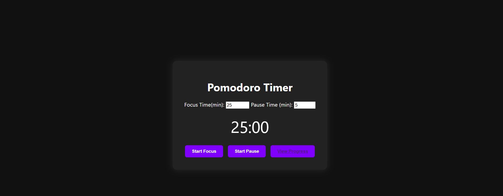

# Pomodoro App

This is a simple web application that helps users apply the Pomodoro Technique to stay focused and track their study or work sessions.

## Features

- Set custom focus and break durations
- Real-time timer with start/stop functionality
- Automatic session logging to a local SQLite database
- Dashboard with charts to visualize productivity over time

## Tech Stack

- Python (Flask)
- SQLite
- HTML/CSS/JavaScript
- Chart.js for the dashboard

## How to Run

1. Install dependencies:
   ```
   pip install -r requirements.txt
   ```

2. Run the app:
   ```
   python app.py
   ```

3. Open your browser and go to:
   ```
   http://localhost:5000
   ```

## Screenshots

Timer Page | Dashboard  
:--:|:--:  
 | 


